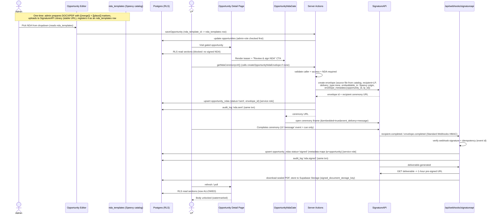
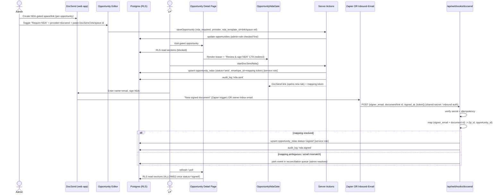
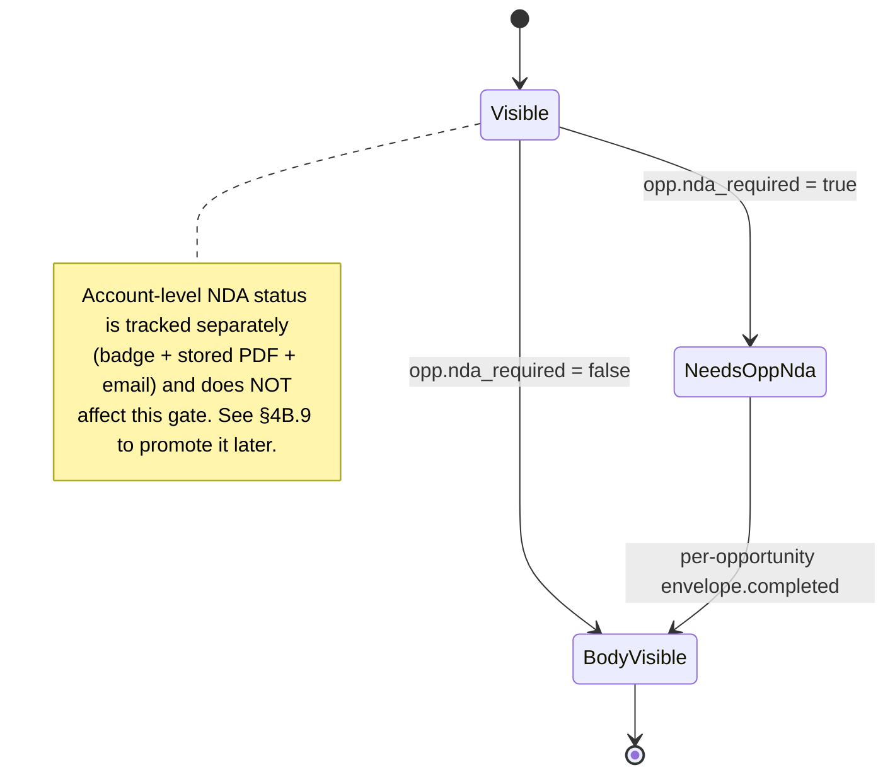
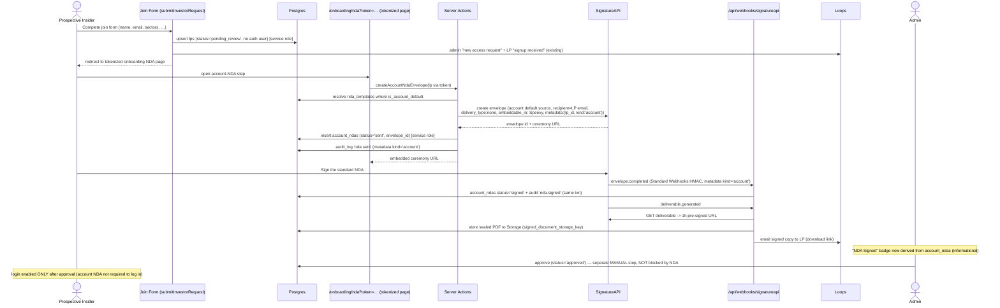

# NDA Gate — Design / Planning Doc

> Status: **Decisions recorded; partially confirmed.** No application code is
> changed by this doc.
> Scope: gating an opportunity's **section body** behind a completed NDA.
>
> **Step 1+2 are BUILT & in production** (migrations `0013`/`0014`): the
> `nda_templates` catalog, admin management UI, the NDA dropdown in the
> opportunity editor persisting `opportunities.nda_template_id` (now a `uuid` FK
> to `nda_templates`), a server-only SignatureAPI client/env, and the
> per-opportunity gate (`opportunities.nda_required` + `nda_template_id` +
> `opportunity_ndas`, RLS-gated on a signed `opportunity_ndas` row). The
> insider/outsider visibility model also shipped via migration `0012` — but
> **status-based**, not the `lp_audience` column §4A proposed (see the §4A
> reconciliation note). **§4B below is the next design increment** and is the
> authoritative spec for the expanded NDA model.
>
> **Decisions taken by the user (v1):**
> 1. **Signing engine = SignatureAPI (committed).** `signature_provider` stays
>    pluggable in the schema, but v1 ships `'signatureapi'` only. (The column
>    currently defaults to `'dropbox_sign'` — §5 proposes a migration to change
>    the default/enum to `'signatureapi'`.) **Dropbox Sign is demoted to
>    "Alternatives Considered"** alongside DocuSign / Documenso / PandaDoc /
>    DocSend; it is retained and documented (including why it was passed over:
>    Enterprise account + sales gate for API/embedded signing, low monthly
>    signature-request caps otherwise, and high cost). The DocSend paths (and the
>    honest "no usable direct DocSend API" finding) are likewise retained as
>    Alternatives, not a v1 build target.
> 2. **Countersignature = undecided** — left as an open question. The data model
>    and flow are designed so adding a Harpoon countersigner later is
>    **non-breaking**: the unlock keys off the **all-signers / `envelope.completed`**
>    event (SignatureAPI's `recipients` array, parallel or sequential), not a
>    single signer's completion.
> 3. **Access model redesign (§4A) = PARTIALLY SUPERSEDED.** The team shipped a
>    *status-based* insider/outsider model (migration `0012`: insider =
>    `lps.status = 'approved'` sees all non-draft opportunities; the
>    `opportunity_access` grant path is kept for outsider / password / shared-link
>    users) and **chose to KEEP the password/outsider mechanism**, not remove it.
>    §4A's `lp_audience` column and "delete the password flow" recommendations
>    are therefore not the current direction — see the reconciliation note atop
>    §4A.
> 4. **Account-level NDA = the new design (§4B), as an INFORMATIONAL status.** A
>    single **account-level NDA** is surfaced once per investor (insiders *and*
>    outsiders), signed once, and stored as a **tracked NDA status + badge** on
>    the investor. Per the user's locked scope, it is **manual/informational and
>    does NOT automatically gate viewing or login.** The **only automatic NDA
>    gate remains the per-opportunity NDA** (`opportunities.nda_required` +
>    `opportunity_ndas` + the existing RLS section gate). Plus: store every
>    signed NDA, surface them in the admin investor profile drawer, and email the
>    signer a copy. A future option to promote the account NDA to a hard gate is
>    preserved under §4B.9. See **§4B**.

---

## 1. Executive Summary & Core Recommendation

### What the user wants (mental model)

> "Create the NDA in our DocSend account, then in Speevy on an opportunity page
> select that DocSend document as the NDA they must complete to view the
> opportunity. Wire it so that to see the opportunity, they must have already
> completed the NDA."

This is the right product shape. The friction is **not** product — it's that
DocSend gives us almost nothing to build a *reliable, transactional* completion
signal on.

### The honest constraint (verified June 2026, high confidence)

- There is **no public/self-serve DocSend developer REST API, no SDK, no
  developer docs**, and DocSend is absent from the Dropbox developer platform.
- There is **no native (non-Zapier) developer-registered DocSend webhook** for
  "agreement/NDA signed".
- The `api.docsend.com/v1` "docs" on rollout.com / apirefs.com are **fabricated
  SEO spam** — those endpoints 404; `api.docsend.com` just 302s to the web app
  (it is the SPA's private backend, not a public API).
- An "Enterprise-only API" is claimed only by secondary blogs, contradicted by
  others, undocumented by Dropbox — **UNVERIFIED**; must be confirmed with
  DocSend sales before we design against it.
- **iframe + postMessage is not viable**: DocSend sends
  `X-Frame-Options: SAMEORIGIN` and emits no signed-event `postMessage`.
- Reverse-engineering the private SPA API is **rejected** for a compliance
  product (fragile + ToS risk).

The only real DocSend completion signals are:

1. **DocSend → Zapier "New signed document" trigger** → Zapier Webhook action →
   a Speevy webhook endpoint. Reliable/managed, but inserts Zapier as a third
   party. From our code's POV it is still "a signed POST to our endpoint."
2. **Inbound-email signal**: on completion DocSend emails the link **owner**
   (and signer) a signed copy + signature certificate. A dedicated owner inbox +
   inbound-email parser (Postmark/SendGrid Inbound Parse) → webhook → flip the
   gate. **Brittle** (email delays/spam/template changes/parsing); best-effort,
   not transactional; needs a manual backstop. (Note: Dropbox's "auto-save
   signed DocSend docs to Dropbox" feature **excludes NDAs**, so that cleaner
   path is unavailable.)

### Core recommendation (decided)

**v1 ships a single signing engine: SignatureAPI.** The gate is keyed on the
existing `opportunity_ndas.signature_provider` column, which stays pluggable, but
v1 only implements `'signatureapi'`.

- **Engine — SignatureAPI (committed).** Real eSignature API with **embeddable
  signing ceremonies** inside Speevy (`embeddable_in` origin whitelist +
  `&embedded=true&event_delivery=message`), **Standard Webhooks** HMAC-verified
  events (`recipient.completed` / `envelope.completed` = the clean "unlock the
  body" trigger; `deliverable.generated` = sealed PDF ready), arbitrary
  **`envelope_metadata`** echoed back on every event (so `(lp_id,
  opportunity_id)` mapping needs no separate lookup), and a sealed signed-PDF +
  audit-log **Deliverable** retrievable via a 1-hour pre-signed URL. The phased
  plan (§11) builds toward this and nothing else for v1.

**Why SignatureAPI over Dropbox Sign (recorded rationale):**

- **Dropbox Sign requires an Enterprise account + a sales process** to unlock
  API / embedded-signing access, and is otherwise limited to very few signature
  requests per month — and is expensive. That gate is a poor fit for a small
  team shipping now.
- **SignatureAPI is self-serve**: ~**$25/mo with the first 100 envelopes
  included, then ~$0.25/envelope, billed only on *completed* envelopes**, plus a
  **free test tier** and **no sales process**.
- **Compliance signals:** SignatureAPI is **SOC 2 Type II** and claims
  **ESIGN / UETA / eIDAS-SES** conformance.
- **Vendor-youth risk (be honest):** founded **2023**, **GA Oct 2024**. It is a
  young vendor. **Before go-live we must obtain an SLA, the SOC 2 Type II
  report, and a signed DPA** (see the due-diligence checklist in §11), and keep
  `signature_provider` pluggable so we can swap engines if the vendor falters.

**Alternatives Considered (not v1):** Dropbox Sign (Enterprise gate + low volume
caps + cost), DocuSign (heavier/pricier), PandaDoc, Documenso (self-host/operate
yourself), and DocSend (no usable direct API/webhook — see the constraint above;
only viable via Zapier/inbound-email bridges). Any of these can slot in later via
a new `signature_provider` value without touching the gate's RLS or core schema.

> **Coupled decision (proposed):** the access model is also being reworked — see
> **§4A** — so that *every* viewer is an authenticated LP and an NDA is required
> universally. That redesign is what lets the universal-NDA rule be enforced
> cleanly in one place (RLS).

---

## 2. Decision Matrix (engine decision: **SignatureAPI**)

> **Decided:** v1 = SignatureAPI. The matrix below is retained as the rationale
> for that decision and as the reference for the alternatives (Dropbox Sign,
> DocSend, Documenso) we are **not** building in v1.

Dimensions scored for our specific context (internal LP portal, Reg D 506(b),
low-to-moderate signing volume, compliance-sensitive, small eng team shipping
now).

| Dimension | **SignatureAPI** | Dropbox Sign | DocSend + Zapier/email | Documenso (self-host) |
|---|---|---|---|---|
| Onboarding / access | **Self-serve, no sales process; free test tier** | **Enterprise account + sales process** for API/embedded | DocSend plan + Zapier/inbound-email plumbing | Self-host, no vendor signup |
| Real-time signal reliability | **High** — Standard Webhooks HMAC, retries | High — HMAC webhook | Medium/Low — relay hop or email parsing | High — but you operate it |
| Audit / compliance fit (Reg D 506(b)) | **High** — sealed PDF + audit log Deliverable; SOC 2 Type II; ESIGN/UETA/eIDAS-SES | High — audit-trail PDF | Medium/Low — cert indirect | High — you own the infra |
| Mapping to (lp, opportunity) | **Cleanest** — arbitrary `envelope_metadata` echoed on every event | Stored `signature_request_id` → record lookup | Email/document heuristics + manual queue | Your own metadata |
| Countersignature (Harpoon signs too) | **Native** — `recipients` array, parallel/sequential; `envelope.completed` | Native | Weak/manual | Supported |
| Embedded vs redirect UX | **Embedded** ceremony iframe (`embeddable_in` + `event_delivery=message`) | Embedded (JS SDK + app client id) | Redirect (DocSend `SAMEORIGIN`) | Embedded possible |
| Reusable NDA source | DOCX/PDF in **Library by URL** or upload API; `{{merge}}` / `[[place]]` markers; **Speevy-owned catalog** | First-class hosted **template id** + list API | DocSend link/space | Your templates |
| Cost / plan tier | **~$25/mo, first 100 envelopes incl., then ~$0.25/completed envelope** | Enterprise pricing; low monthly caps otherwise | DocSend + Zapier/email vendor | Infra + ops time |
| Vendor maturity / longevity | **Young** (founded 2023, GA Oct 2024) — get SLA/SOC2/DPA | Established | Established | You own it |
| Build effort | **Low–Medium** (REST + Standard Webhooks + catalog table) | Low–Medium (SDK + webhook) but blocked on sales | Medium/High (mapping + backstop) | High (self-host + ops) |

### Outcome & where the alternatives could still win

- **Chosen for v1: SignatureAPI.** Self-serve, embeddable, clean webhook +
  metadata mapping, strong compliance signals, low cost. Its one real risk is
  vendor youth, mitigated by keeping `signature_provider` pluggable and doing
  pre-go-live due diligence (§11).
- **Dropbox Sign (alternative, not v1):** the natural fallback engine if
  SignatureAPI falters — mature and well-trodden, but blocked behind an
  Enterprise account + sales process and higher cost, with low monthly caps
  otherwise. Slots in via `signature_provider = 'dropbox_sign'`.
- **DocSend (alternative, not v1):** only if the deck's DocSend hosting + viewer
  analytics become a hard requirement, and only via Zapier/inbound-email bridges
  (no usable direct API). Prefer a hybrid: DocSend hosts the deck, the committed
  engine signs.
- **DocuSign / PandaDoc (alternatives, not v1):** heavier and pricier; revisit
  only if an enterprise procurement or specific feature forces it.
- **Documenso (alternative, not v1):** only if we later need to drop all
  external eSignature vendors and operate signing infra ourselves.

---

## 3. End-to-End Flows

### 3a. SignatureAPI (embedded ceremony) — the v1 flow



**Countersignature-ready (decision deferred).** The unlock fires on the
**all-signers** signal — `envelope.completed` — **not** a single recipient's
`recipient.completed`. If Harpoon later decides the NDA needs a Harpoon
countersigner, add a second entry to SignatureAPI's `recipients` array
(signer / approver — parallel or sequential); the gate logic is unchanged
because the body unlocks only once the **envelope** is complete. No schema or RLS
change is needed; `opportunity_ndas.status='signed'` means "fully executed."
(For a single-signer NDA, `recipient.completed` and `envelope.completed`
coincide; keying on `envelope.completed` is the forward-compatible choice — see
§6.1.)

### 3b. Provider Flow Comparison (SignatureAPI vs Dropbox Sign)

Side-by-side of the v1 engine (SignatureAPI) against the closest alternative
(Dropbox Sign), to make the architectural differences explicit:

| Stage | **SignatureAPI (v1)** | Dropbox Sign (alternative) |
|---|---|---|
| **NDA setup / reuse** | No hosted "Template" resource. Reuse via a **DOCX/PDF source file** stored in the dashboard **Library** (stable URL) or via the "store an upload" API, with **`{{merge}}`** placeholders for dynamic content and **`[[place]]`** placeholders for signature/field positions. | First-class **hosted Template** with editor + a stable **template id**. |
| **Admin "pick an NDA" dropdown** | Backed by a **Speevy-owned `nda_templates` catalog table** (SignatureAPI has no listable template API), populated after the admin registers a Library file. | Backed by Dropbox Sign's live **"list templates"** API. |
| **Send / sign** | `createOpportunityNdaEnvelope`: create envelope from the catalog source file, `delivery_type: none`, `embeddable_in` whitelists the Speevy origin, attach `envelope_metadata` `{opportunity_id, lp_id}` → returns a **recipient ceremony URL** embedded in an iframe with **`&embedded=true&event_delivery=message`**. | Create signature request from **`template_id`** + embedded signing URL via the **JS SDK / app client id**. |
| **Completion webhook** | **Standard Webhooks** HMAC (`webhook-signature` header, `standardwebhooks` lib). `recipient.completed` / `envelope.completed`. **`envelope_metadata` is echoed on every event** → `(lp_id, opportunity_id)` maps directly, **no separate lookup strictly required** (still persist the envelope id). | HMAC (`event_hash`) `signature_request_all_signed`; map via a stored **`signature_request_id` → (lp, opportunity)** record. |
| **Executed document** | **Deliverable** = sealed signed PDF **+ audit log**; `deliverable.generated` → `GET deliverable` returns a **1-hour pre-signed URL** → store to Supabase Storage. | Fetch executed PDF via API after `all_signed`. |
| **Countersignature** | `recipients` array (signer / approver / preparer / automatic signer), **parallel or sequential**; **`envelope.completed`** = all done. | Add signer to template; **`signature_request_all_signed`** = all done. |
| **Idempotency / mapping store** | Event id (Standard Webhooks) + persisted `envelope_id`. | Provider event id + persisted `signature_request_id`. |

Both engines converge on the same Speevy invariant: **`opportunity_ndas.status =
'signed'` is written only on the all-signers event**, and that single row is what
RLS checks. The provider is an implementation detail behind
`signature_provider`.

### 3c. DocSend-hosted NDA + completion bridge — *Alternative / Future (not v1)*



---

## 4. Enforcement Design (Belt & Suspenders)

The gate already exists in RLS. The work is (a) wiring the *write* of the
`signed` row, and (b) **closing the service-role bypass on the detail page** so
the gate is actually enforced for non-LP viewers.

### 4.1 What RLS already enforces (good)

`opportunity_sections` SELECT for an LP requires a signed NDA when
`nda_required = true`:

```207:215:supabase/migrations/0001_rls_policies.sql
        and (
          o.nda_required = false
          or exists (
            select 1 from public.opportunity_ndas n
            where n.opportunity_id = o.id
              and n.lp_id = public.current_lp_id()
              and n.status = 'signed'
          )
        )
```

This is correct **only for a real session LP** reading via their RLS-bound
client. It is the database's independent check.

### 4.2 The service-role bypass gotcha (must fix)

The detail page picks the content client by viewer kind. Only `lp` uses the
RLS-bound session client; `admin` and `guest` use the service-role client, which
**bypasses the NDA gate entirely**:

```622:625:app/opportunities/[opportunityId]/page.tsx
  // Belt and suspenders: admins and outsiders read via the service-role client
  // (guarded by the checks above); invited LPs read via their RLS-bound session
  // so the database independently enforces their access.
  const contentClient = viewerKind === 'lp' ? serverSupabase : supabase;
```

```708:712:app/opportunities/[opportunityId]/page.tsx
  const { data: sections } = await contentClient
    .from('opportunity_sections')
    .select('type, position, data')
    .eq('opportunity_id', opportunity.id)
    .order('position', { ascending: true });
```

**Resolution by viewer kind:**

- **Real session LP (`viewerKind === 'lp'`):** unchanged. RLS enforces the NDA
  gate at the DB. This is the authoritative path.
- **Admin (`viewerKind === 'admin'`):** allowed to read the body **as an explicit
  preview**, but the page MUST:
  1. Render a visible "Admin preview — NDA gate not applied" banner whenever
     `nda_required = true` and no signed `opportunity_ndas` row exists for an
     impersonated/real LP, so admins are never fooled into thinking the gate is
     live.
  2. Continue to NOT write an `opportunity.viewed` LP audit row for admins
     (current behavior already only logs `lp`/`guest`).
- **Password guest (`viewerKind === 'guest'`):** **this is the real hole** in
  *today's* model. A guest currently reads sections via service role, bypassing
  the NDA gate, because guests have no `auth.uid()`/`current_lp_id()` for RLS to
  key on.
  - **Recommended resolution (proposed): delete the guest path entirely** via
    the access-model redesign in **§4A**. If password-protected sharing is
    removed and every viewer is an authenticated LP, this whole branch — and the
    service-role section read for non-admins — disappears, and the NDA gate is
    enforced in exactly one place (RLS). This is the clean fix.
  - **Interim (only if the redesign is not adopted):** add an explicit
    application-layer NDA check for guests before the service-role section read,
    using the guest's outsider `lp_id` against `opportunity_ndas` (see §4.4).

### 4.3 Server-Action enforcement (second belt)

Every NDA-related Server Action validates, in order:
1. **Caller identity/role** (admin actions check `is_admin()`-equivalent first
   line; LP actions resolve `current_lp_id()`).
2. **Access** to the opportunity (`visible_to_all_approved_lps` OR a non-revoked
   `opportunity_access` row), mirroring the existing interest action checks in
   `app/opportunities/actions.ts`.
3. **Opportunity state** (`nda_required = true`, published, not archived).

The `createOpportunityNdaEnvelope` / `getNdaCeremonyUrl` actions never return a
ceremony URL for a caller who lacks access — preventing NDA-link harvesting.

### 4.4 Password-guest × NDA policy (superseded by §4A if the redesign lands)

The recommended direction (**§4A**) **removes password-protected sharing
altogether**, which dissolves this tension: there are no anonymous guests, so
there is no guest×NDA edge case and no service-role section read to guard. This
subsection is retained only as the fallback if the §4A redesign is **not**
adopted.

Fallback options if password sharing is kept (recommended = Option 1):

- **Option 1: An NDA opportunity is never password-shared.** Make the NDA
  requirement and `password_protected` mutually exclusive in the editor +
  `saveOpportunity` validation. NDA deals require an attributable, authenticated
  LP — the Reg D 506(b) posture. Removes the guest×NDA bypass by construction.
- **Option 2: Guests can also be NDA-gated.** A guest must complete the NDA;
  their outsider `lp_id` keys `opportunity_ndas`, and the detail page adds an
  explicit guest NDA check before the service-role section read. More surface
  area, weaker identity assurance.

Whichever fallback is chosen, the guest service-role section read MUST be
guarded by an explicit NDA check (or made impossible via Option 1, or eliminated
via §4A).

---

## 4A. Access Model Redesign — Insider/Outsider + Universal NDA *(Partially superseded — see note)*

> **⚠️ RECONCILIATION (read first).** §4A was the original proposal. The shipped
> reality and the newer direction diverge from it on two points:
>
> 1. **Insider/outsider is status-based, not a new `lp_audience` column.**
>    Migration `0012` made **insider = `lps.status = 'approved'`** (an approved
>    LP sees every non-draft opportunity with no per-deal grant), and kept the
>    **`opportunity_access`** grant path as the additive allow-path for
>    outsiders / shared-link / password users. So §4A.2's `lp_audience` enum and
>    §4A.3's `opportunity_audience` enum were **not** adopted; the admin UI
>    derives a display `kind: 'insider' | 'outsider'` from status (the
>    `'outsider'` lifecycle value), not from a dedicated audience column.
> 2. **The password/outsider mechanism is KEPT, not removed.** The user now
>    explicitly wants to retain the outsider/password path and **attach the
>    account-level NDA to it** (§4B.5). So §4A.6's "delete the password
>    mechanism + guest bypass" and §4A.8's destructive migration are **not** the
>    current plan. The guest service-role read on the detail page (§4.2) still
>    needs an **app-layer NDA check** (it is no longer dissolved by removing
>    guests).
> 3. **"Universal NDA" is dropped, not relocated.** §4A.4 proposed making the
>    *per-opportunity* NDA always-on. That is **not** done. The per-opportunity
>    NDA stays an **optional** `nda_required` toggle (the only automatic gate),
>    and the **account-level NDA (§4B) is an informational status, not a gate.**
>    Do **not** add an account-NDA clause to `opportunity_sections` RLS at this
>    time (a future hard-gate option is preserved under §4B.9).
>
> The rest of §4A is retained for context (audience-vs-lifecycle reasoning,
> admin-preview, teaser-stays-visible) but defer to **§4B** wherever they
> conflict.

### 4A.1 The proposed model in one paragraph

Retire password-protected pages. Every investor is an **authenticated** LP
classified as **insider** or **outsider**. Every opportunity declares an
**audience** (insiders / outsiders / both). An LP can see an opportunity's
**row** (title, teaser) if they're approved and the audience matches; they can
see the **body** only after completing the NDA — and the NDA is **universal**
(required for every opportunity body, no per-deal opt-out). Because there are no
anonymous guests anymore, *all* reads go through RLS as a session user, so the
universal-NDA rule lives in exactly one enforceable place.

### 4A.2 Lifecycle vs audience are separate concerns (keep them separate)

`lps.status` is a **lifecycle** field — where the LP is in onboarding:

```43:53:db/schema.ts
export const lpStatus = pgEnum('lp_status', [
  'invited',
  'onboarding',
  'pending_review',
  'approved',
  'rejected',
  'removed',
  // People who unlocked a password-protected opportunity via a shared direct
  // link (email + password). Not invited LPs; no auth user. See 0008 migration.
  'outsider',
]);
```

"Insider vs outsider" is **not** a lifecycle stage — it's a durable
**classification/audience** of the investor that is orthogonal to how far along
onboarding they are. Conflating them (as the current `'outsider'` *status* value
does) is exactly what we want to undo. **Recommendation: add a separate
classification column** rather than overloading `status`:

```
-- new enum + column on lps
create type lp_audience as enum ('insider', 'outsider');
alter table public.lps
  add column audience lp_audience not null default 'outsider';
```

- `lps.status` keeps tracking lifecycle (`invited → onboarding → … → approved`).
- `lps.audience` tracks classification (`insider` | `outsider`).
- The legacy `lps.status = 'outsider'` **value is retired** (see migration
  §4A.6): those rows become real (or invited) LPs whose `audience = 'outsider'`.

A helper mirrors the existing RLS helpers:

```sql
create or replace function public.current_lp_audience()
returns lp_audience
language sql stable security definer set search_path = public
as $$ select audience from public.lps where profile_id = auth.uid() $$;
```

### 4A.3 Opportunity audience: recommend a single selector that **allows "both"**

Add an audience selector to the opportunity, replacing
`visible_to_all_approved_lps`:

```
create type opportunity_audience as enum ('insiders', 'outsiders', 'both');
alter table public.opportunities
  add column audience opportunity_audience not null default 'insiders';
```

**Recommendation: one selector with three values (`insiders | outsiders |
both`),** not two independent checkboxes. Three values cover every real case
(insider-only, outsider-only, everyone) while making the common mistake —
accidentally showing an insider deal to outsiders — impossible to express
ambiguously. `both` exists because some teasers/listings are legitimately for
everyone (it replaces today's `visible_to_all_approved_lps = true`).

**Per-LP `opportunity_access`: keep it, but make it optional and additive.**
Audience-based visibility becomes the *primary* gate. `opportunity_access`
remains useful as an **explicit narrowing allowlist** for deals that must be
shown to *specific* LPs rather than a whole audience (e.g., "this insider deal is
only for these three LPs"). Concrete rule:

- If an opportunity has **no** `opportunity_access` rows → visibility is purely
  by audience match.
- If an opportunity **has** `opportunity_access` rows → it is restricted to
  those LPs (still subject to audience match + approved status). This preserves
  the current granular-control capability without forcing per-LP grants on every
  deal.

(If the team prefers maximum simplicity, `opportunity_access` could be dropped
and visibility made purely audience-based — but keeping it as an optional
override costs nothing and retains flexibility. Recommendation: **keep it**.)

### 4A.4 Universal NDA: make it always-on, retire the per-deal toggle

Today the body gate is conditional on `opportunities.nda_required`. Under the
proposed model the NDA is **universal**:

- **RLS:** drop the `o.nda_required = false OR …` branch from the
  `opportunity_sections` policy so a signed NDA is **always** required to read
  the body (sketch in §4A.5).
- **Column:** **keep `nda_required` but default it `true` and remove the editor
  toggle.** Rationale: retaining the column gives us a documented, admin-only
  escape hatch (e.g., a future "open teaser pack" deal) without a migration, and
  avoids a destructive column drop. In practice it is always `true` and not
  surfaced in the editor. (Alternative: drop the column outright — cleaner but
  irreversible; **recommendation: keep + default true**.)
- **Title/teaser stay visible pre-NDA.** RLS gates *sections*, not the
  opportunity *row*, so an LP still sees what they're being asked to sign for.
  This is unchanged and is the intended behavior (confirmed against the existing
  policy split between `opportunities` and `opportunity_sections`).

### 4A.5 Revised RLS sketch

```sql
-- opportunities ROW: approved LP + published + audience match
--   (+ optional opportunity_access allowlist when present)
create policy "opportunities: lp read by audience"
  on public.opportunities for select
  using (
    exists (
      select 1 from public.lps
      where lps.profile_id = auth.uid() and lps.status = 'approved'
    )
    and published_at is not null
    and (
      audience = 'both'
      or (audience = 'insiders'  and public.current_lp_audience() = 'insider')
      or (audience = 'outsiders' and public.current_lp_audience() = 'outsider')
    )
    and (
      -- no explicit allowlist => audience alone governs
      not exists (
        select 1 from public.opportunity_access oa
        where oa.opportunity_id = opportunities.id and oa.revoked_at is null
      )
      -- else must be on the allowlist
      or exists (
        select 1 from public.opportunity_access oa
        where oa.opportunity_id = opportunities.id
          and oa.lp_id = public.current_lp_id()
          and oa.revoked_at is null
      )
    )
  );

-- opportunity_sections BODY: same visibility, NDA now ALWAYS required
create policy "opportunity_sections: lp read with universal nda gate"
  on public.opportunity_sections for select
  using (
    exists (
      select 1
      from public.opportunities o
      where o.id = opportunity_sections.opportunity_id
        and o.published_at is not null
        and exists (
          select 1 from public.lps
          where lps.profile_id = auth.uid() and lps.status = 'approved'
        )
        and (
          o.audience = 'both'
          or (o.audience = 'insiders'  and public.current_lp_audience() = 'insider')
          or (o.audience = 'outsiders' and public.current_lp_audience() = 'outsider')
        )
        and (
          not exists (
            select 1 from public.opportunity_access oa
            where oa.opportunity_id = o.id and oa.revoked_at is null
          )
          or exists (
            select 1 from public.opportunity_access oa
            where oa.opportunity_id = o.id
              and oa.lp_id = public.current_lp_id()
              and oa.revoked_at is null
          )
        )
        -- UNIVERSAL NDA: no nda_required escape hatch in the policy
        and exists (
          select 1 from public.opportunity_ndas n
          where n.opportunity_id = o.id
            and n.lp_id = public.current_lp_id()
            and n.status = 'signed'
        )
    )
  );
```

This is a near-mechanical edit of the existing policies in
`supabase/migrations/0001_rls_policies.sql` (lines 155–217): swap the
`visible_to_all_approved_lps`/access logic for the audience logic, and remove the
`nda_required = false` branch.

### 4A.6 What gets REMOVED (and why it's a security win)

Removed by this redesign:

- **`opportunities.password_protected`** column and the separate
  **`opportunity_access_passwords`** table (note: the password is stored in that
  dedicated table, not a `password_hash` column on `opportunities`).
- **`OpportunityPasswordGate`** component
  (`components/webflow/opportunity-password-gate.tsx`).
- **`unlockOpportunity`** server action (`app/opportunities/actions.ts`) and the
  guest interest path that depends on it.
- **The outsider signed-cookie machinery** in `lib/opportunity-access.ts` (both
  the access token and the 30-day "verified" token) and the
  `opportunityPasswordMatches` helper in `lib/opportunity-password.ts`.
- **The `lps.status = 'outsider'` value** (replaced by `lps.audience = 'outsider'`
  on real LP rows).
- **Crucially, the service-role section read for non-admins** on the detail page
  (`app/opportunities/[opportunityId]/page.tsx` ~line 622, the
  `viewerKind === 'lp' ? serverSupabase : supabase` branch).

**Why this is a major security win, not just cleanup:** today the detail page
has *three* viewer kinds (`admin`, `lp`, `guest`) and two read paths, and two of
the three (`admin`, `guest`) read sections via the **service-role client, which
bypasses RLS**. That means the NDA gate is, in practice, only enforced for real
session LPs. Removing the guest path makes **every non-admin viewer an
authenticated session user hitting RLS**, so:

- The universal-NDA rule is enforced in **exactly one place** (the
  `opportunity_sections` policy) instead of being re-implemented in app code.
- There is **no anonymous, cookie-based access** to gated bodies at all.
- The attack/Bug surface shrinks dramatically: no password brute-forcing, no
  cookie forgery questions, no "did we remember to check the NDA before the
  service-role read" footguns.

The only remaining service-role section read is the **admin preview** (§4A.7).

### 4A.7 Admin preview (the one allowed bypass)

Admins still need to see an opportunity body to build/QA it. Keep a single,
explicit admin path:

- Admins read sections via the service-role client (admin-all RLS would also
  permit it), **clearly labeled in-page**: "Admin preview — NDA not enforced."
- **Admin preview does NOT count as NDA satisfaction** and writes **no**
  `opportunity.viewed` LP audit row (consistent with today's behavior of only
  logging `lp`/`guest`).
- If an admin is *also* an LP on a deal and wants to experience the real gate,
  they go through the normal LP flow (sign the NDA); preview is explicitly the
  unenforced view.

### 4A.8 Migration plan

Additive, then destructive-in-a-later-step (so we can verify before dropping):

1. **Add columns/enums** (`lp_audience`, `opportunity_audience`, `lps.audience`,
   `opportunities.audience`) and the `current_lp_audience()` helper. Backfill:
   - Existing **approved invited LPs** → `audience = 'insider'` (they were the
     trusted, invited cohort).
   - Existing **`lps.status = 'outsider'`** rows → `audience = 'outsider'`. These
     have **no auth user** today, so they cannot view bodies under the new model
     until they authenticate. Treat them as **leads to (re)invite**: keep the
     row + interest history, and the new invite/onboarding flow turns them into
     authenticated outsider LPs. (Until they accept, they simply can't view —
     which is correct.)
   - Map **opportunity visibility:** `visible_to_all_approved_lps = true` →
     `audience = 'both'` (or `'insiders'` if "approved LPs" meant insiders only —
     **flag each such opportunity for admin confirmation**, do not silently
     guess). Password-protected opportunities were shared to outsiders → default
     `audience = 'outsiders'` (or `'both'`), **also flagged for admin review**.
2. **Swap RLS** to the §4A.5 policies; keep the old columns in place but unused.
3. **Repoint the detail page** to remove the guest path and read all non-admin
   sections via the RLS-bound session client; keep only the labeled admin
   preview.
4. **Remove the password UI/actions/cookies** (§4A.6) once (2)+(3) are verified.
5. **Drop** `password_protected`, `opportunity_access_passwords`, and retire the
   `outsider` status value in a final cleanup migration.
6. `opportunity_access` rows are **preserved** as the optional allowlist (§4A.3);
   no data migration needed beyond confirming intent.

**Unchanged:** admin promotion remains migration-only (no app path sets
`role='admin'`), and all money stays in `*_cents` bigint. This redesign touches
visibility/NDA, not those invariants.

### 4A.9 New open questions raised by this model

1. **Do admins viewing as preview need to sign?** Recommendation: **no** —
   preview is explicitly the unenforced view and is audit-flagged; admins sign
   only if they want to test the real LP flow.
2. **Can an LP be reclassified insider↔outsider, and what happens to their
   signed NDAs / access?** Recommendation: NDAs are keyed on
   `(opportunity_id, lp_id)`, **not** audience, so a signed NDA **survives
   reclassification** and stays valid for that opportunity. Reclassification
   only changes which *new* opportunities they can see (audience match);
   already-signed deals remain accessible if still audience-eligible. Define what
   happens if reclassification makes a previously-visible deal no longer match
   (recommend: row + body become hidden, but the historical NDA record and audit
   trail are retained).
3. **Should `'both'` audience exist?** Recommendation: **yes** (covers
   everyone-listings; replaces `visible_to_all_approved_lps`).
4. **Does universal NDA change the invite/onboarding flow?** Yes — outsiders can
   no longer "unlock" via password; they must be **invited and authenticate**.
   Confirm the onboarding flow can mint outsider-classified LP accounts and that
   the NDA step fits before first body view.
5. **Is there any opportunity that should be viewable without an NDA?** Confirm:
   under universal NDA, **no body** is viewable pre-NDA, but **title/teaser
   remain visible** (RLS gates sections, not the row). If a true "no-NDA teaser
   listing" is ever needed, that's the only reason to keep `nda_required` as an
   admin escape hatch (§4A.4).
6. **Outsider self-visibility scope:** should an outsider see *all* `outsiders`
   opportunities by default, or only those explicitly allowlisted via
   `opportunity_access`? (Ties to §4A.3; recommend audience-by-default with
   optional allowlist.)

---

## 4B. Account-Level NDA + Per-Opportunity NDA *(the confirmed design)*

> **Status: CONFIRMED.** Builds directly on the shipped Step 1+2
> (per-opportunity NDA + `nda_templates` catalog + SignatureAPI engine).
>
> **Scope decision (locked by the user): the account-level NDA is an
> INFORMATIONAL / MANUAL status only — it is NOT an automatic viewing gate.**
> The only **automatic** NDA gate remains the existing **per-opportunity** gate
> (`opportunities.nda_required` + `opportunity_ndas` + the RLS section gate
> already built). The account NDA is captured, stored, badged, and emailed, but
> it does **not** participate in RLS or the body-view check at this time. A
> hard-gate "two-tier RLS" design is preserved under **§4B.9 (Deferred /
> Future)** in case the user later promotes the account NDA to a real gate.

### 4B.1 The model in one paragraph

There are two NDAs, with different roles:

- **Account-level NDA ("the standard NDA") — tracked status, no automatic gate.**
  One NDA, tied to the **investor account**, surfaced **once** (after signup for
  insiders; after the password flow for outsiders), signed **once**, and
  **never re-signed**. Its result is stored as an NDA status on the investor
  (derived from the `account_ndas` row) and shown as a badge. It is
  **informational/manual**: admins use it to decide when to approve, but
  **nothing automatically blocks viewing or login on it.**
- **Per-opportunity NDA (existing, optional) — the only automatic gate.** When
  an opportunity's **Require NDA** box is checked
  (`opportunities.nda_required = true`), that specific opportunity needs an NDA,
  enforced by the **already-built** `opportunity_ndas` + RLS section gate. This
  is unchanged from Step 1+2.

The two are independent documents (different `nda_templates` rows, separate
envelopes, separate signature records).

### 4B.2 Decision logic — "can this LP view this opportunity body?"

**Automatic enforcement (what RLS / the app actually checks) — unchanged from
Step 1+2:**

```
canViewBody(lp, opp) =
      isVisible(lp, opp)                      -- existing 0012 visibility:
                                              --   approved insider + non-draft,
                                              --   OR opportunity_access grant
  AND ( opp.nda_required = false              -- per-opportunity NDA only if required
        OR opportunityNdaSigned(lp, opp) )
```

The **account-level NDA is intentionally NOT in this expression.** It is tracked
and badged but does not gate viewing.

As a table (assume visibility already satisfied; title/teaser are always visible
regardless — RLS gates *sections*, not the row):

| `opp.nda_required` | Per-opp NDA | Body visible? | Account NDA |
|---|---|---|---|
| `false` | n/a | **Yes** | irrelevant to the gate (tracked only) |
| `true` | ✗ signed | **No** — blocked at the per-opportunity gate | irrelevant to the gate |
| `true` | ✓ signed | **Yes** | irrelevant to the gate |



### 4B.3 Data model — where the account-level signature lives

**Recommendation: a dedicated `account_ndas` table** (one row per LP), parallel
to `opportunity_ndas`. Justification vs the alternatives:

- **Reuse `opportunity_ndas` with a nullable `opportunity_id`** — rejected. The
  table is `NOT NULL opportunity_id` with `unique(opportunity_id, lp_id)` and a
  FK cascade; making `opportunity_id` nullable weakens that contract and forces
  every per-opportunity query to filter out account rows. Two clean tables beat
  one overloaded one.
- **Reuse `lp_documents` (`type = 'nda'`)** — rejected as the *source of truth*.
  `lp_documents` stores only `{type, label, storage_key}` — no envelope id, no
  signature lifecycle/status, no provider. It cannot be the gate's authoritative
  record. (We *may* additionally write an `lp_documents` row on completion so the
  signed NDA also appears in any generic "documents" list — optional, §4B.7.)
- **Dedicated `account_ndas`** — chosen. Mirrors `opportunity_ndas` exactly (so
  the webhook/storage/email code is shared), gives a clean `unique(lp_id)` "one
  account NDA per investor," and references the `nda_templates` row that was
  signed so historical signatures stay attributable across template versions.

```
account_ndas (
  id uuid pk default gen_random_uuid(),
  lp_id uuid not null unique references lps(id) on delete cascade,
  nda_template_id uuid not null references nda_templates(id),  -- which standard NDA was signed
  signature_provider text not null default 'signatureapi',     -- pluggable, mirrors opportunity_ndas
  envelope_id text not null unique,
  status signature_status not null default 'sent',             -- reuse existing enum
  sent_at timestamptz not null default now(),
  signed_at timestamptz,
  declined_at timestamptz,
  expired_at timestamptz,
  signed_document_storage_key text,                            -- sealed PDF in private Storage
  last_webhook_event_id text,                                  -- idempotency
  created_at timestamptz not null default now(),
  updated_at timestamptz not null default now()
)
```

- `unique(lp_id)` enforces the "signed once, never re-signed" rule structurally.
- Soft-disable / lifecycle via the `signature_status` enum + `*_at` timestamps
  (consistent with conventions; no `is_deleted`).
- Writes are **service-role only** (webhook + onboarding action), exactly like
  `opportunity_ndas`; RLS allows admin read + LP read-own.

#### Designating THE standard account NDA in the catalog

The admin must mark **which `nda_templates` row is the account-level default.**
**Recommendation: a boolean flag `nda_templates.is_account_default`** with a
**partial unique index** so at most one active row is the default:

```
alter table public.nda_templates
  add column is_account_default boolean not null default false;

create unique index nda_templates_one_account_default
  on public.nda_templates (is_account_default)
  where is_account_default = true and archived_at is null;
```

- The onboarding/outsider flows resolve "the standard NDA" by selecting the
  active `is_account_default = true` row. If none is set, the account-NDA step is
  simply skipped and the admin sees a setup warning. (Because the account NDA is
  informational only and does not gate viewing, a missing default never blocks an
  LP — it just means no account NDA is captured yet.)
- Open question (flagged, §11): **one standard NDA for everyone vs different for
  insiders vs outsiders.** A single boolean covers "one for all." If we later
  need distinct insider/outsider account NDAs, replace the boolean with a small
  role column (e.g. `account_default_for text check in ('all','insider','outsider')`)
  or a settings table — non-breaking because `account_ndas.nda_template_id`
  already records exactly which template each LP signed.

#### Account-NDA status: derived, not denormalized (recommended)

The "NDA Signed / NDA Pending" indicator (§4B.6) is **derived**:
`exists(account_ndas where lp_id = … and status = 'signed')`. No new column on
`lps` is required, which avoids drift. If the investors table query cost ever
matters, add a cached `lps.account_nda_status signature_status` updated by the
webhook in the same transaction — but start derived.

### 4B.4 RLS — UNCHANGED (account NDA is not in the gate)

**No RLS change is made for the account-level NDA.** Per the locked scope
decision, the account NDA is informational/manual and does **not** gate viewing.
The `opportunity_sections` body policy stays exactly as shipped in migration
`0012` (visibility + the optional per-opportunity NDA branch). Do **not** add an
account-NDA clause to RLS at this time.

The per-opportunity gate and its outsider/service-role app-layer handling are
unchanged from Step 1+2. (If/when the account NDA is promoted to a hard gate,
the helper + policy + the outsider app-layer check live in **§4B.9**.)

### 4B.5 Onboarding / approval flow *(confirmed)*

#### Insider path (join form → pending lead → push account NDA → manual approve)

> **✅ Confirmed — signup is UNCHANGED from today (Option A).**
> `submitInvestorRequest` (the join form) creates a lightweight **pending `lps`
> lead row** (`status = 'pending_review'`) and notifies admins — **no auth user,
> no login** at this point. This is exactly today's behavior.
> **(Option B — minting an auth user at form completion — is REJECTED.)**
> The **new** piece is a separate **account-NDA step after signup**, hosted on a
> tokenized onboarding page (`/onboarding/nda?token=…`, signed/single-use) that
> the LP reaches right after the form, since they have no auth session yet.

**Confirmed rules:**

- **No automatic NDA→approval logic.** Approval is a **manual admin action** and
  is **never hard-blocked** by the account NDA. Admins will typically wait for
  the "NDA Signed" badge before approving, but nothing enforces it.
- **Approval is the only login gate.** Until `status = 'approved'` an investor
  **cannot log in**; once approved they **can log in even if the account NDA is
  not signed**. The account NDA does not affect login.
- **NDA-signed status is derived** from the `account_ndas` row (§4B.3) and shown
  as a badge (§4B.6) — there is no enforcement column.



- The account NDA is **captured for the record and shown as a badge**, nothing
  more. It does not gate login or viewing (the per-opportunity gate is the only
  automatic NDA gate).

#### Outsider (password) path — same account NDA, surfaced once

**The password/outsider mechanism stays.** The outsider passes the password
gate, supplies email, and verifies a code, after which `findOrCreateOutsiderLp`
creates an `lps` row (`status = 'outsider'`) and a signed access cookie.
**New step:** once we have their email + outsider `lp_id`, surface the **same**
account-level NDA (`is_account_default` template) **once**.

- Same `createAccountNdaEnvelope` action, keyed on the outsider `lp_id` (resolved
  from the access cookie rather than `auth.uid()`); `envelope_metadata.kind =
  'account'`.
- The ceremony embeds on the gated page (the outsider has a cookie session, not
  auth). On `envelope.completed` the webhook writes `account_ndas` for that
  `lp_id`, stores the PDF, and emails the copy — identical to the insider path.
- **Signed once:** `unique(lp_id)` on `account_ndas` plus matching on the same
  email/`lp_id` means a returning outsider never re-signs.
- **Informational/manual, like insiders.** The outsider's account NDA is tracked
  and badged but does **not** add any automatic gate beyond the existing
  per-opportunity NDA. (Outsiders still rely on `opportunity_access` / the
  password path for visibility, unchanged.)

### 4B.6 Admin UX deltas (beyond Step 1+2)

- **Investors table badge.** Add an account-NDA indicator next to the existing
  status/kind badges in `components/webflow/admin-investors-table.tsx`. Extend
  `AdminInvestorRow` with `accountNdaSigned: boolean` (+ optional `accountNdaSignedAt`),
  populated by the `/admin/investors` page query (join `account_ndas`). Render a
  small badge: **"NDA Signed"** (e.g. `cellstatus`) vs **"NDA Pending"** (e.g.
  `cellstatus draft`). Show it in both the row and the slideout header.
- **"Signed NDAs" section in the profile drawer.** In `InvestorSlideout`, add a
  read-only section listing **all** of that investor's executed NDAs:
  - the **account-level** NDA (from `account_ndas`), and
  - **each per-opportunity** NDA (from `opportunity_ndas`, labeled with the
    opportunity title).

  Each row shows the template name/opportunity, signed date, and a **View /
  Download** action that calls a server action returning a **short-lived signed
  URL** (or hits a tokenized download route, §4B.8) for the
  `signed_document_storage_key`. Admin-only; never exposes the raw storage key.
- **Mark the account-default template.** In the existing admin **NDA Templates**
  view, add a "Set as account default" control (radio/toggle) that calls a new
  `setAccountDefaultNdaTemplate(templateId)` action (admin-only; flips
  `is_account_default`, relying on the partial unique index to keep it singular).

### 4B.7 Webhook / server-action changes (beyond Step 1+2)

**Server actions (new / extended):**

- `createAccountNdaEnvelope(lpRef)` / `getAccountNdaCeremonyUrl(lpRef)` — the
  account-tier analog of `createOpportunityNdaEnvelope` / `getNdaCeremonyUrl`.
  Resolves the `is_account_default` template, creates a SignatureAPI envelope with
  `envelope_metadata = { lp_id, kind: 'account' }`, upserts `account_ndas`
  (`status='sent'`) + `nda.sent` audit in one txn, returns the ceremony URL.
  Idempotent: if a non-terminal `account_ndas` row exists, reuse it; if already
  `signed`, return "already signed."  Caller resolution differs by path: session
  LP via `current_lp_id()`; outsider via the access cookie's `lp_id`.
- `setAccountDefaultNdaTemplate(templateId)` — admin-only catalog action (§4B.6).
- `getAccountNdaStatus()` — poll helper (mirrors §7.4 `getNdaStatus`) for the
  onboarding/outsider ceremony to flip to "signed."
- Profile-drawer data: a server action (or page-level query) returning the
  investor's `account_ndas` + `opportunity_ndas` with freshly signed URLs.

**Webhook (`app/api/webhooks/signatureapi/route.ts`) — branch on `kind`:**

The single SignatureAPI webhook (§6.1) now routes by `envelope_metadata.kind`:

- `kind = 'account'` → upsert **`account_ndas`** for `lp_id`.
- `kind = 'opportunity'` (or absent, for back-compat) → upsert
  **`opportunity_ndas`** for `(opportunity_id, lp_id)` — unchanged from Step 1+2.

Everything else is shared: Standard Webhooks HMAC verification, idempotency on
the event id, `recipient.completed`/`envelope.completed → 'signed'` (keyed on
the all-signers event so countersignature stays non-breaking), and on
`deliverable.generated` download the sealed PDF → private Supabase Storage →
`signed_document_storage_key`. Audit rows reuse `nda.sent`/`nda.signed` with
`metadata.kind` distinguishing the tier (optionally add `account_nda.sent` /
`account_nda.signed` enum values if we want first-class audit filtering).

**Email-on-signed (both tiers).** After **any** NDA reaches `signed` and its PDF
is stored, trigger the Loops "signed NDA copy" email to the signer's email
(§4B.8). Fire it from the webhook (the source of truth), wrapped in
`Promise.allSettled` + failure logging like the existing Loops calls, so an email
failure never blocks the gate flip.

### 4B.8 Email design — Loops "your signed NDA"

The current Loops integration (`lib/loops/transactional.ts`) uses the
`/transactional` endpoint with **`dataVariables` only** — **no attachments are
wired today**, and the existing helpers (`sendLpApprovedEmail`, etc.) send only
template variables.

- **Recommendation: send a short-lived signed download *link*, not an
  attachment.** Add `sendNdaSignedCopyEmail({ email, ndaName, signedAt,
  downloadUrl, idempotencyKey })` following the existing helper pattern
  (`Idempotency-Key` header + `dataVariables`), backed by a new
  `LOOPS_TEMPLATE_NDA_SIGNED_COPY` env id and a `hasLoops…Env()` guard.
- **Robust link via a tokenized download route** (recommended over emailing a raw
  1-hour signed URL that expires before the LP opens it): email a Speevy URL like
  `/nda/download/[token]` where the token authorizes the specific
  `account_ndas` / `opportunity_ndas` row; the route validates the token and
  **re-issues a fresh signed Storage URL** on each click. Keeps links working
  for a sane window without exposing storage keys or long-lived public URLs.
- **If Loops attachments are later enabled** (Loops transactional supports a
  base64 `attachments` array on accounts where it's turned on), we can attach the
  PDF directly — flagged as an **open question** (confirm Loops plan supports
  attachments). Until confirmed, the link approach is the default.
- **PII discipline:** the email goes to the signer's own address; do not log the
  address or attach contents to analytics (per `.cursorrules`).

### 4B.9 DEFERRED / FUTURE — promoting the account NDA to a hard viewing gate

> **Not built now.** This subsection preserves the original "two-tier hard gate"
> design in case the user later decides the account-level NDA should become an
> **automatic precondition** for viewing any opportunity body (i.e. no body
> visible until the account NDA is signed, in addition to the per-opportunity
> NDA). It requires **no schema change** beyond what §4B already adds — only an
> RLS swap + the outsider app-layer check. Until then, the account NDA stays
> informational (§4B.2/§4B.4).

If promoted, add a `SECURITY DEFINER` helper mirroring `current_lp_id()`:

```sql
create or replace function public.current_lp_has_account_nda()
returns boolean
language sql stable security definer set search_path = public
as $$
  select exists (
    select 1 from public.account_ndas a
    join public.lps l on l.id = a.lp_id
    where l.profile_id = auth.uid()
      and a.status = 'signed'
  );
$$;
```

…and replace the `opportunity_sections` body policy (migration `0012`) with the
two-tier version — visibility unchanged, **account NDA always required**, and the
per-opportunity NDA still only when `nda_required = true`:

```sql
create policy "opportunity_sections: lp read with two-tier nda gate"
  on public.opportunity_sections for select
  using (
    exists (
      select 1
      from public.opportunities o
      where o.id = opportunity_sections.opportunity_id
        -- visibility unchanged from 0012 (approved-insider non-draft OR access grant)
        and (
          (
            exists (
              select 1 from public.lps
              where lps.profile_id = auth.uid() and lps.status = 'approved'
            )
            and o.status <> 'draft'
          )
          or exists (
            select 1 from public.opportunity_access oa
            where oa.opportunity_id = o.id
              and oa.lp_id = public.current_lp_id()
              and oa.revoked_at is null
          )
        )
        -- (FUTURE) account-level NDA required
        and public.current_lp_has_account_nda()
        -- per-opportunity NDA only when the deal requires it (unchanged)
        and (
          o.nda_required = false
          or exists (
            select 1 from public.opportunity_ndas n
            where n.opportunity_id = o.id
              and n.lp_id = public.current_lp_id()
              and n.status = 'signed'
          )
        )
    )
  );
```

**Outsider / password-guest caveat (only relevant if promoted).** Outsiders have
**no auth user** and read via the **service-role client** on the detail page
(`viewerKind === 'guest'`, §4.2), which bypasses RLS. So this RLS protects
session LPs (insiders) only; for guests the same account-NDA-signed check would
have to be enforced **in app code** before the service-role section read, keyed
on the guest's outsider `lp_id`. (None of this applies while the account NDA is
informational.)

---

## 5. Data Model Deltas

### 5.1 What already exists (reuse, do not duplicate)

On `opportunities`:

```223:226:db/schema.ts
  ndaRequired: boolean('nda_required').notNull().default(false),
  ndaTemplateId: text('nda_template_id'),
  watermarkEnabled: boolean('watermark_enabled').notNull().default(false),
  passwordProtected: boolean('password_protected').notNull().default(false),
```

The `opportunity_ndas` table already models a per-LP, per-opportunity signature
with provider, envelope id, status lifecycle, and signed-PDF storage key:

```298:311:db/schema.ts
export const opportunityNdas = pgTable('opportunity_ndas', {
  id: uuid('id').primaryKey().defaultRandom(),
  opportunityId: uuid('opportunity_id').notNull().references(() => opportunities.id, { onDelete: 'cascade' }),
  lpId: uuid('lp_id').notNull().references(() => lps.id, { onDelete: 'cascade' }),
  signatureProvider: text('signature_provider').notNull().default('dropbox_sign'),
  envelopeId: text('envelope_id').notNull(),
  status: signatureStatus('status').notNull().default('sent'),
  sentAt: timestamp('sent_at', { withTimezone: true }).notNull().defaultNow(),
  signedAt: timestamp('signed_at', { withTimezone: true }),
  signedDocumentStorageKey: text('signed_document_storage_key'),
}, (t) => ({
  uniqOpportunityLp: uniqueIndex('opportunity_ndas_opp_lp_idx').on(t.opportunityId, t.lpId),
  envelopeIdx: uniqueIndex('opportunity_ndas_envelope_idx').on(t.envelopeId),
}));
```

The `signatureStatus` enum (`sent|viewed|signed|declined|expired`) and the
`audit_action` enum values `nda.sent` / `nda.signed` already exist. RLS on
`opportunity_ndas` already allows admin read + LP read-own, with writes intended
via service role.

### 5.2 Provider default change + meaning of `nda_template_id` per provider

**Proposed migration (not code here):** `opportunity_ndas.signature_provider`
currently defaults to `'dropbox_sign'`:

```302:302:db/schema.ts
  signatureProvider: text('signature_provider').notNull().default('dropbox_sign'),
```

Change the default to **`'signatureapi'`** (and, if we later constrain it to an
enum/CHECK, make `'signatureapi'` the first/primary value with `'dropbox_sign'`,
`'docsend'`, `'documenso'` retained). It stays a `text` column so the provider
remains pluggable without further migrations.

`nda_template_id` is the admin's "select which document is the NDA" field.
**Key change for SignatureAPI:** unlike Dropbox Sign, SignatureAPI has **no
hosted, listable Template resource with an id**. Reuse is via a DOCX/PDF source
file in the SignatureAPI **Library** (referenced by a stable URL) with
`{{merge}}` (dynamic content) and `[[place]]` (signature/field position)
markers. There is nothing to "list," so the admin dropdown must be backed by a
**Speevy-owned catalog table** (`nda_templates`, §5.3). Therefore:

- **Repurpose `opportunities.nda_template_id`** to hold the **`nda_templates.id`**
  (a Speevy catalog row), **not** a provider-side id. The catalog row carries the
  provider-specific source reference.

| `signature_provider` | What the NDA source is | Where `nda_template_id` points |
|---|---|---|
| `signatureapi` (v1) | DOCX/PDF in SignatureAPI **Library** (stable URL) or stored upload, with `{{merge}}`/`[[place]]` markers | **`nda_templates.id`** (Speevy catalog row that stores `source_file_url` + fields config) |
| `dropbox_sign` (alt) | Dropbox Sign hosted **template id** | Could point at an `nda_templates` row whose config stores the Dropbox template id, or directly at the template id |
| `docsend` (alt) | DocSend **link/space identifier** | DocSend link/space ref |
| `documenso` (future) | Documenso template id | Documenso UI |

### 5.3 Proposed additions

#### `nda_templates` — the Speevy-owned NDA catalog (NEW, required for v1)

Because SignatureAPI exposes no listable template API, Speevy owns the catalog
the admin dropdown reads from:

```
nda_templates (
  id uuid pk default gen_random_uuid(),
  name text not null,                     -- admin-facing label, e.g. "Standard Mutual NDA v2"
  signature_provider text not null default 'signatureapi',
  source_file_url text not null,          -- SignatureAPI Library URL (or stored-upload ref)
  fields_config jsonb not null default '{}', -- {{merge}} fields + [[place]] positions / recipient roles
  version integer not null default 1,
  archived_at timestamptz,                -- soft-disable; never hard delete (audit)
  created_by_profile_id uuid not null references profiles(id),
  created_at timestamptz not null default now(),
  updated_at timestamptz not null default now()
)
```

- `opportunities.nda_template_id` references an `nda_templates.id` (a published,
  non-archived row).
- Admin-managed via admin-only Server Actions (§7); admin-read RLS, no LP access.
- Versioning: bump `version` (or create a new row) when the NDA text changes, so
  historical `opportunity_ndas` remain attributable to the exact NDA signed.

#### `opportunity_ndas` correlation key

`opportunity_ndas.envelope_id` is already `NOT NULL UNIQUE`. We reuse it as the
**per-attempt correlation key**:

- **SignatureAPI (v1):** `envelope_id` = SignatureAPI **envelope id**. Even
  though `envelope_metadata` echoes `(opportunity_id, lp_id)` on every event
  (so mapping needs no lookup), we **still persist the envelope id** for
  idempotency, support, and audit cross-reference.
- **Dropbox Sign (alt):** `envelope_id` = `signature_request_id`.
- **DocSend (alt):** `envelope_id` = a Speevy-generated mapping token (UUID), as
  DocSend gives no envelope id up front.

Recommended **new columns** (one small migration; additive, nullable):

| Column | Table | Purpose |
|---|---|---|
| `last_webhook_event_id text` | `opportunity_ndas` | Idempotency: last processed provider event id; reject duplicates |
| `provider_account_ref text` | `opportunity_ndas` *(or `nda_templates`)* | Which provider account/Library the NDA source lives under |
| `declined_at timestamptz` / `expired_at timestamptz` | `opportunity_ndas` | Lifecycle timestamps to match the status enum (optional but tidy) |

`opportunity_ndas.signed_document_storage_key` **already exists** and is exactly
where we store the SignatureAPI Deliverable (sealed PDF) after
`deliverable.generated` (see §6.1).

#### `nda_webhook_events` — idempotency + (DocSend) reconciliation

Recommended **new table** for robust idempotency across providers; doubles as the
DocSend reconciliation queue (alt path only):

```
nda_webhook_events (
  id uuid pk default gen_random_uuid(),
  provider text not null,                 -- signatureapi | dropbox_sign | docsend
  provider_event_id text,                 -- Standard Webhooks event id / Dropbox event id / synthesized (DocSend)
  event_type text,                        -- recipient.completed | envelope.completed | deliverable.generated | ...
  opportunity_nda_id uuid references opportunity_ndas(id),  -- resolved via envelope_metadata (SignatureAPI) or lookup
  signer_email text,                      -- DocSend mapping only; SCRUBBED from logs
  document_ref text,                      -- DocSend link/space id (alt)
  status text not null default 'received',-- received | applied | unmatched | duplicate
  raw_payload jsonb,                      -- minus PII where feasible
  received_at timestamptz not null default now(),
  unique (provider, provider_event_id)
)
```

For **SignatureAPI** mapping is direct (via `envelope_metadata`), so events go
straight to `applied`; `unmatched` is essentially a DocSend-only concern. The
table's primary v1 job is the **idempotency anchor** (`unique (provider,
provider_event_id)`), independent of `opportunity_ndas`.

---

## 6. Webhook / Ingestion Design

All webhook routes are **new** (none exist today; the only non-page route
handler is `app/admin/investors/bulk-approve/route.ts`). All use the
service-role client `lib/supabase/admin.ts` **only after** authenticating the
request, per `.cursorrules`.

### 6.1 SignatureAPI — `app/api/webhooks/signatureapi/route.ts` *(primary, v1)*

- **Auth:** verify the **Standard Webhooks** signature on the `webhook-signature`
  header using the **`standardwebhooks`** library + the signing secret. Reject on
  mismatch (401). Validate on the **first lines**, before any service-role use.
- **Mapping (clean):** read `(opportunity_id, lp_id)` from the **`envelope_metadata`**
  echoed on every event — **no separate lookup strictly required**. Still
  cross-check against the persisted `opportunity_ndas.envelope_id` for defense in
  depth.
- **Idempotency:** insert into `nda_webhook_events` keyed on
  `(provider='signatureapi', provider_event_id)`; on conflict → `duplicate`,
  200, no-op.
- **State machine** (SignatureAPI statuses → existing
  `signature_status` enum `sent|viewed|signed|declined|expired`):
  - envelope created / sent → `sent`
  - recipient viewed/opened ceremony → `viewed`
  - **`recipient.completed`** (single required signer) / **`envelope.completed`**
    (all recipients done) → **`signed`** (the unlock trigger; key off
    `envelope.completed` so countersignature stays non-breaking — §3a)
  - recipient declined / envelope canceled → `declined`
  - envelope expired → `expired`
- **On `deliverable.generated`:** `GET deliverable` → **1-hour pre-signed URL**;
  download the **sealed signed PDF + audit log** and upload to a **private**
  Supabase Storage bucket; set `signed_document_storage_key` (column already
  exists) and `signed_at`. Serve only via short-lived signed URLs (mirror the
  1-hour asset pattern on the detail page).
- **Transactional audit:** write the `opportunity_ndas` upsert + `audit_log`
  (`nda.sent` / `nda.signed`) in the **same DB transaction**.
- **Edge cases:** `envelope.completed` may arrive before/after
  `deliverable.generated`; flip the gate on completion and attach the PDF when
  the deliverable lands (two events, idempotent). A late completion after
  `expired` transitions to `signed` with an audit note.

### 6.2 Dropbox Sign — `app/api/webhooks/dropbox-sign/route.ts` *(Alternative / Future)*

- **Auth:** verify the Dropbox Sign **HMAC** (`event_hash = HMAC-SHA256(api_key,
  event_time + event_type)`). Reject on mismatch (401). Dropbox Sign also
  requires echoing `Hello API Event Received` for the test ping.
- **Idempotency:** insert into `nda_webhook_events` keyed on
  `(provider, provider_event_id)`; on conflict → `duplicate`, 200, no-op.
- **State machine:** map events →
  `signature_request_sent` → `sent`,
  `signature_request_viewed` → `viewed`,
  `signature_request_signed` (one signer) → keep `sent`/`viewed`,
  `signature_request_all_signed` → **`signed`** (the unlock trigger),
  `signature_request_declined` → `declined`,
  `signature_request_expired` → `expired`.
- **Mapping:** via a stored `signature_request_id` → `(lp, opportunity)` record
  (no metadata echo like SignatureAPI).
- **On `signed`:** fetch the executed PDF via API, upload to Supabase Storage
  (private bucket), set `signed_document_storage_key`, set `signed_at`.
- **Transactional audit:** same as §6.1.

### 6.3 DocSend via Zapier relay — `app/api/webhooks/docsend/route.ts` *(Alternative / Future)*

- **Auth:** **shared-secret** header (Zapier Webhook action sends a fixed bearer/
  HMAC of body with a secret only Speevy + the Zap know). Constant-time compare.
- **Payload:** `{ signer_email, signer_name, document_ref (link/space id),
  signed_at, [mapping_token] }`.
- **Mapping** `(event) → (lp_id, opportunity_id)`:
  1. `document_ref` → the opportunity whose `nda_template_id` matches (requires
     **one DocSend link per opportunity** convention).
  2. `signer_email` → an `lps` row (invited LP) for that opportunity's access.
     Ideally a **per-LP link** makes this exact; otherwise match by email.
  3. If both resolve uniquely → upsert `opportunity_ndas` to `signed` + audit.
  4. If ambiguous / email not found / multiple matches → park in
     `nda_webhook_events` as `unmatched` for **manual admin reconciliation**.
- **Idempotency:** synthesize `provider_event_id` from
  `hash(document_ref + signer_email + signed_at)` when Zapier doesn't supply one.

### 6.4 DocSend via inbound-email — `app/api/webhooks/docsend-inbound/route.ts` *(Alternative / Future)*

- **Auth:** provider (Postmark/SendGrid) inbound-parse webhook secret + verify
  the message was delivered to the dedicated owner inbox; verify sender domain is
  DocSend's. Reject otherwise.
- **Parse:** extract `signer_email`, document identity, and (if present) the
  signature-certificate attachment from the DocSend "signed copy" email.
- **Mapping + idempotency:** identical to §6.2, but treat as **best-effort**:
  email delay/spam/template changes are expected. Always pair with the manual
  backstop. Synthesize `provider_event_id` from message-id.

### 6.5 Cross-cutting

- **No LP PII in logs / PostHog / error reports** — scrub `signer_email`/name
  before any log line or analytics event (per `.cursorrules`).
- **Service-role only after auth** — every route validates signature/secret on
  the **first lines**, before touching `createSupabaseAdminClient()`.
- **Edge cases:** (SignatureAPI) completion vs deliverable event ordering is
  idempotent (§6.1); (DocSend alt) email mismatch → `unmatched` queue, signer who
  isn't an invited LP → `unmatched` (do not auto-create access); duplicate
  events → `duplicate`; late all-signers event after `expired` → transition to
  `signed` with an audit note.

---

## 7. Server Action Design

Colocated per convention. Admin actions live in
`app/admin/opportunities/actions.ts`; LP-facing NDA actions in
`app/opportunities/actions.ts` (alongside `unlockOpportunity` /
`saveOpportunityInterest`).

### 7.1 Persist `nda_template_id` (+ provider) from the editor

`saveOpportunity` already persists `nda_required` but **drops the template id**:

```49:52:app/admin/opportunities/actions.ts
  ndaRequired: z.boolean(),
  watermarkEnabled: z.boolean(),
  passwordProtected: z.boolean(),
  password: z.string().optional(),
```

```292:294:app/admin/opportunities/actions.ts
    nda_required: data.ndaRequired,
    watermark_enabled: data.watermarkEnabled,
    password_protected: data.passwordProtected,
```

**Add** `ndaTemplateId` (pointing at an `nda_templates.id`) + `ndaProvider`
(defaulting to `'signatureapi'`) to the Zod schema and the persisted fields, with
a **cross-field refinement**: if NDA is required then `ndaTemplateId` must
reference a published, non-archived `nda_templates` row; if Option 1 (§4.4) is
chosen, also refine `!(ndaRequired && passwordProtected)`. First line still
validates admin role (as the existing action does).

### 7.1b Admin catalog actions — manage `nda_templates`

Admin-only Server Actions (first line validates admin role) to run the catalog
the editor dropdown reads from:

- `createNdaTemplate({ name, sourceFileUrl, fieldsConfig, provider })` — register
  a SignatureAPI Library file (or stored upload) as a catalog row.
- `updateNdaTemplate` / `archiveNdaTemplate` — edit/soft-disable; never hard
  delete (preserve attribution for already-signed `opportunity_ndas`).
- `listNdaTemplates` — non-archived rows for the editor dropdown.

These do **not** call SignatureAPI to "create a template" (there is no such
resource); they record the Speevy-side reference to a source file the admin
prepared and uploaded to the Library (§9 workflow).

### 7.2 `createOpportunityNdaEnvelope()` + `getNdaCeremonyUrl()` — SignatureAPI (embedded)

- Validate caller is an approved session LP (`current_lp_id()`), has access to
  the opportunity, and the NDA is required.
- Resolve the opportunity's `nda_template_id` → `nda_templates` row → its
  `source_file_url` + `fields_config`.
- If no `opportunity_ndas` row for `(opportunity, lp)`: **create a SignatureAPI
  envelope** from the source file with the LP as recipient, `delivery_type:
  none`, `embeddable_in` whitelisting the Speevy origin, and **`envelope_metadata:
  { opportunity_id, lp_id }`**. Upsert `opportunity_ndas` (`status='sent'`,
  `envelope_id = <SignatureAPI envelope id>`, `signature_provider='signatureapi'`)
  via service role; write `nda.sent` audit row in the same txn.
- Return the **recipient ceremony URL** for embedding (the client appends
  `&embedded=true&event_delivery=message`). `getNdaCeremonyUrl()` can be the
  idempotent entry point that creates-if-missing then returns the URL.

### 7.3 `startDocSendNda()` — DocSend (redirect) *(Alternative / Future)*

- Same validation as 7.2.
- Mint a mapping token (UUID), upsert `opportunity_ndas` (`status='sent'`,
  `envelope_id = token`, `signature_provider='docsend'`), write `nda.sent`.
- Return the opportunity's DocSend link for the client to open in a new tab.
  Completion arrives later via §6.3/§6.4.

### 7.4 `getNdaStatus()` — poll helper

- Returns the caller's `opportunity_ndas.status` for the opportunity so the gate
  component can poll for `signed` and then `router.refresh()`. Reads via the
  RLS-bound session client (LP can read own row). The webhook (§6.1) is the
  source of truth; the SignatureAPI `event_delivery=message` event is only a UX
  cue to trigger a refresh.

All actions return discriminated-union results
(`{ status: 'success' | 'error', ... }`) matching the existing action style.

---

## 8. LP-Facing UX

New component **`components/webflow/opportunity-nda-gate.tsx`**, distinct from
`components/webflow/opportunity-password-gate.tsx`. The password gate is for
shared-link outsiders and is **orthogonal**; do not overload it.

Key UX states:

- **Teaser-visible gate (default):** The opportunity row (title, teaser) is
  always visible to an LP with access — RLS gates *sections*, not the row, so the
  LP knows what they're being asked to sign for. The gate renders the teaser plus
  a **"Review & sign NDA"** CTA, and a blocked-body empty state where sections
  would be.
- **SignatureAPI (embedded ceremony — v1):** CTA calls `getNdaCeremonyUrl()`,
  then renders the **ceremony URL in an iframe** with
  `&embedded=true&event_delivery=message`. The in-page `message` event is a
  **UX cue only** (e.g. to flip to "pending confirmation" / trigger a refresh) —
  **the §6.1 webhook is the source of truth** for `signed`. Never unlock the
  body off the client message alone.
- **DocSend (redirect — alt/future):** CTA calls `startDocSendNda()` and opens
  the DocSend link in a **new tab** (no embed — `X-Frame-Options: SAMEORIGIN`).
- **Pending / poll-for-completion:** after the ceremony, poll `getNdaStatus()`
  (or `router.refresh()`) until status is `signed`. Because completion is
  webhook-driven and can lag slightly, show an honest "We're confirming your
  signature — this can take a moment" state with a manual "I've signed" refresh
  and a fallback contact line.
- **Post-sign unlock:** sections render; if `watermark_enabled`, the existing
  `PageWatermark` (LP email + tiled, low opacity) applies. Keep the watermark
  copy honest: deterrent/attribution, not screenshot prevention.

The gate component is a client component receiving typed props (provider, CTA
copy, opportunity slug, current status) from the server detail page — no
client-side fetching of opportunity data, per `.cursorrules`.

---

## 9. Admin UX

Extend the existing editor `components/webflow/opportunity-editor.tsx`. The
"Require NDA" toggle already exists in the Opportunity Settings card:

```2453:2462:components/webflow/opportunity-editor.tsx
                  <div className="fieldblock">
                    <CheckboxRow
                      label="Require NDA"
                      checked={ndaRequired}
                      onChange={(checked) => {
                        setNdaRequired(checked);
                        markDirty();
                      }}
                    />
                  </div>
```

**Add, directly beneath the toggle, conditional on `ndaRequired === true`:**

1. **NDA document dropdown** — a `<Select>` populated from the **Speevy
   `nda_templates` catalog** (`listNdaTemplates`, non-archived). Maps to
   `opportunities.nda_template_id` (→ `nda_templates.id`). This is **not** a live
   provider "list templates" call — SignatureAPI exposes no such API; the
   dropdown reads Speevy's own catalog.
2. **Validation** — block save when NDA is required and no template selected
   (client + the §7.1 Zod refinement). If Option 1 (§4.4), keep NDA and
   password-protected mutually exclusive.

Keep it visually within the existing Webflow `cardblock`/`fieldblock` markup;
the dropdown can be a shadcn `Select` styled to match.

#### Admin NDA-template workflow (catalog management)

Because SignatureAPI reuse is file-based (no hosted template id), registering a
new NDA is a short, explicit workflow:

1. **Prepare the document offline** — author the NDA as a DOCX/PDF and add
   **`{{merge}}`** placeholders for dynamic content (e.g. LP name, date) and
   **`[[place]]`** placeholders for signature/field positions.
2. **Upload to the SignatureAPI Library** — store it permanently there; copy its
   **stable source-file URL** (or use the "store an upload" API reference).
3. **Register it in Speevy** — via the admin catalog UI (`createNdaTemplate`),
   creating an `nda_templates` row (`name`, `source_file_url`, `fields_config`,
   `version`). Now it appears in the opportunity editor dropdown.

A dedicated admin **"NDA Templates"** management view (list / add / edit /
archive, never hard-delete) backs this. The opportunity editor only *selects*
from the catalog; it never edits source files.

For the DocSend alternative only, an **NDA reconciliation** panel (list
`nda_webhook_events` with `status='unmatched'`, manually attach to the correct
`(lp, opportunity)`) would be the manual backstop — not needed for SignatureAPI,
whose `envelope_metadata` maps events directly.

---

## 10. Security & Compliance (per `.cursorrules`)

- **Reg D 506(b) posture:** NDAs are tied to **invited, identifiable LPs**. This
  is the core reason Option 1 (§4.4) — no NDA on anonymous password-shared
  links — is recommended: a compliance signature needs an attributable signer.
- **Audit logging:** every NDA lifecycle event writes `nda.sent` / `nda.signed`
  (enums already exist) in the **same transaction** as the `opportunity_ndas`
  write. Every LP body read continues to write `opportunity.viewed` (already done
  for `lp`/`guest` on the detail page). Admin previews are flagged and not logged
  as LP views.
- **No LP PII in logs / PostHog / error reports:** scrub `signer_email`, names,
  and certificate contents before any log/analytics/error path. `nda_webhook_events.raw_payload`
  stores the minimum needed for reconciliation and should be access-restricted
  (admin-only RLS), never surfaced to analytics.
- **Signed-URL-only document access:** executed NDA PDFs live in a **private**
  Supabase Storage bucket; access only via short-lived signed URLs (reuse the
  1-hour signed-URL pattern already used for opportunity assets). No public
  buckets.
- **Service-role discipline:** the service-role client is used **only** inside
  webhook handlers (after signature/secret validation) and inside admin-only
  Server Actions (admin role checked first line), per the existing pattern in
  `app/admin/opportunities/actions.ts`. Never shipped to the browser.
- **No admin-role escalation path:** unchanged; this feature touches no
  `profiles.role` writes.

### Vitest + RLS test plan

Simulate **LP** and **admin** DB connections (set the JWT claims / `auth.uid()`)
and assert:

1. **Gate closed:** `nda_required = true`, no signed NDA → LP SELECT on
   `opportunity_sections` returns **zero rows**; the opportunity *row* (title,
   teaser) is still visible.
2. **Gate open:** insert `opportunity_ndas` (`status='signed'`) for that
   `(lp, opportunity)` → LP SELECT on sections now returns rows.
3. **Wrong LP:** a signed NDA for LP A does **not** unlock sections for LP B.
4. **Status partial:** `sent`/`viewed`/`declined`/`expired` do **not** unlock;
   only `signed` does.
5. **Admin:** admin SELECT on sections always returns rows (admin-all policy),
   and the detail page renders the "admin preview" banner when gated.
6. **opportunity_ndas isolation:** LP can read own NDA rows only; cannot read
   another LP's; cannot INSERT/UPDATE (writes are service-role only).
7. **Webhook idempotency:** posting the same provider event twice (same
   Standard Webhooks event id) yields one `opportunity_ndas` transition and one
   audit row; second is `duplicate`.
8. **SignatureAPI mapping correctness:** an `envelope.completed` event whose
   `envelope_metadata` carries `(opportunity_id, lp_id)` flips exactly that
   `(lp, opportunity)` gate and no other; a forged/mismatched signature is
   rejected before any write. (DocSend alt: unknown email parks as `unmatched`
   and flips nothing.)
9. **Server-action authz:** `createOpportunityNdaEnvelope`/`getNdaCeremonyUrl`
   reject callers without access; catalog actions and `saveOpportunity` reject
   non-admins and enforce the template-required + (Option 1) NDA⊕password
   refinements.
10. **Guest path (if Option 2):** a password guest without a signed NDA cannot
    read sections even though the read uses the service-role client (explicit
    app-layer check).

---

## 11. Phased Implementation Plan & Open Questions

v1 builds toward **SignatureAPI only**. The access-model redesign (§4A) is
sequenced as its own track because it is still **pending user confirmation** —
the SignatureAPI engine (Track 1) can ship on today's access model and does not
*block* on §4A, but §4A is what makes the universal-NDA rule clean.

> **Gate before Track 1 go-live:** complete the SignatureAPI due-diligence
> checklist (below). Building against the free test tier can start immediately.

#### Track 1 — SignatureAPI NDA gate (committed)

> **PR 1 + PR 2 are SHIPPED** (migrations `0013`/`0014`): the `nda_templates`
> catalog + admin management and the editor dropdown persisting
> `opportunities.nda_template_id` are in production. PR 3–5 cover the
> per-opportunity signing engine end-to-end.

1. **PR 1 — `nda_templates` catalog + admin management.** ✅ *shipped*
   Migration for `nda_templates`; admin actions (`create/update/archive/list`)
   and a minimal admin "NDA Templates" view. Tests: admin-only access; archive
   preserves attribution.
2. **PR 2 — Editor wiring.** ✅ *shipped*
   Add the NDA-document dropdown (reads `nda_templates`) + `ndaTemplateId` /
   `ndaProvider` (default `'signatureapi'`) to the editor and `saveOpportunity`
   Zod schema + persisted fields. Tests: save round-trips template ref; reject
   NDA-on with no template.
3. **PR 3 — `opportunity_ndas` write plumbing + idempotency table.**
   Migration for `nda_webhook_events` + new columns (§5.3); flip
   `signature_provider` default → `'signatureapi'`. Service-role upsert helpers +
   transactional audit writes. Tests: idempotency, audit rows.
4. **PR 4 — SignatureAPI engine end-to-end.**
   `createOpportunityNdaEnvelope` / `getNdaCeremonyUrl`, embedded ceremony in
   `OpportunityNdaGate`, `app/api/webhooks/signatureapi/route.ts` (Standard
   Webhooks HMAC + status mapping + `envelope_metadata` mapping +
   `deliverable.generated` → sealed PDF to Storage). Unlock keys off
   `envelope.completed` so countersignature is non-breaking later. Env config:
   **test-mode vs live keys** + signing secret. Tests: webhook signature,
   `envelope.completed` → unlock, deliverable stored, RLS gate flip.
5. **PR 5 — LP gate UX polish + poll/refresh.**
   `OpportunityNdaGate` pending/poll state (with `event_delivery=message` cue),
   blocked-body empty state, watermark note.

#### Track 1B — Account-level NDA (informational status, §4B; build on Step 1+2)

Each PR is sized to be reviewable on its own. This track assumes the
per-opportunity engine (Track 1) exists; the account tier reuses its
webhook/storage/email plumbing. **The account NDA is captured/badged/emailed —
it is NOT wired into RLS or the body-view gate** (that hard-gate option is
deferred to §4B.9, not in this plan).

6. **PR 6 — `account_ndas` table + account-default flag.**
   Migration: `account_ndas` (§4B.3) and `nda_templates.is_account_default` +
   partial unique index. Drizzle schema additions. No behavior yet. Tests:
   `unique(lp_id)`; only one active account default.
7. **PR 7 — Account-NDA engine + post-signup ceremony (Option A).**
   `createAccountNdaEnvelope` / `getAccountNdaCeremonyUrl` / `getAccountNdaStatus`
   actions; webhook `kind='account'` branch writing `account_ndas` + storing the
   sealed PDF; wire the **insider** path — signup stays unchanged (pending `lps`
   lead, no auth user), then redirect to the tokenized `/onboarding/nda` page
   hosting the embedded ceremony. No approval/login coupling. Tests:
   envelope→signed flips `account_ndas`; idempotency; deliverable stored;
   approval + login unaffected by NDA state.
8. **PR 8 — Outsider account-NDA surfacing.**
   Surface the same account NDA in the password/outsider flow keyed on the
   outsider `lp_id`; sign-once via `unique(lp_id)`; informational only (no extra
   gate). Tests: returning outsider not re-prompted; no change to outsider
   visibility gating.
9. **PR 9 — Admin profile-drawer "Signed NDAs" + investors-table badge.**
   Derived `accountNdaSigned` on `AdminInvestorRow` + **NDA Signed / NDA Pending**
   badge; "Signed NDAs" drawer section (account + per-opportunity) with
   signed-URL view/download; `setAccountDefaultNdaTemplate` control in the NDA
   Templates view. Tests: badge reflects derived status; download authz
   admin-only.
10. **PR 10 — Email signed copy (Loops) + tokenized download route.**
    `sendNdaSignedCopyEmail` + `LOOPS_TEMPLATE_NDA_SIGNED_COPY`; `/nda/download/[token]`
    route re-issuing fresh signed URLs; fire from the webhook on any
    `signed`+stored (account or per-opportunity). Tests: email fires once
    (idempotent); token route authz + expiry; flow continues if email fails.

> **Deferred (not in this track): promote account NDA to a hard viewing gate.**
> If the user later wants the account NDA to block viewing, add the §4B.9 RLS
> swap (`current_lp_has_account_nda()` + two-tier `opportunity_sections` policy)
> + the outsider app-layer check as a separate PR. Not planned now.

#### Track 2 — Access-model redesign (§4A; LARGELY SUPERSEDED — do not build as-is)

> The team shipped a **status-based** insider model (migration `0012`) and
> **kept** the password/outsider mechanism (now carrying the account-level NDA,
> Track 1B). The original §4A PRs below — introducing an `lp_audience` column and
> **deleting** the password flow — are **not** the current plan. They are
> retained only as the record of the path-not-taken; build them only if the team
> later decides to fully retire the password mechanism.
>
> - ~~PR — add `lp_audience` / `opportunity_audience` columns + `current_lp_audience()`~~ *(superseded by status-based 0012)*
> - ~~PR — swap RLS to audience + force per-opportunity NDA universal~~ *(superseded: per-opportunity NDA stays optional; account NDA is informational, not a gate, §4B)*
> - ~~PR — remove guest path + service-role bypass~~ *(password path kept; the per-opportunity NDA gate already handles guests; the deferred account-NDA hard gate would add an app-layer check per §4B.9)*
> - ~~PR — delete password mechanism / drop `password_protected` / retire `outsider` status~~ *(password mechanism kept)*

#### Future (not scheduled) — alternative engines

11. **Dropbox Sign / DocSend / DocuSign / etc.** slot in behind
    `signature_provider` only if SignatureAPI falters or a deal demands DocSend's
    deck analytics (then prefer the hybrid). DocSend bridge (Zapier relay +
    reconciliation UI / inbound-email) per §3c / §6.3–6.4.

### Open questions (need user/business decisions)

**Engine / signing:**

1. **Countersignature — required?** *Undecided (deferred).* SignatureAPI supports
   it via the `recipients` array (parallel/sequential); the design is already
   non-breaking for adding a Harpoon countersigner later (unlock keys off
   `envelope.completed`). No action needed unless/until the team wants it.

**SignatureAPI-specific (confirm before/at go-live):**

2. **Vendor due diligence:** obtain SignatureAPI's **SLA**, **SOC 2 Type II
   report**, and a signed **DPA** before go-live (vendor is young — founded 2023,
   GA Oct 2024). See the checklist below.
3. **Data residency:** where does SignatureAPI store envelopes, ceremonies, and
   Deliverables (region)? Acceptable for our LPs / counsel?
4. **Vendor longevity / exit plan:** confirm we can export executed PDFs + audit
   logs and that `signature_provider` pluggability gives us a realistic swap to
   Dropbox Sign/DocuSign if needed.
5. **NDA source files:** where do the master DOCX/PDF source files live
   (SignatureAPI Library vs a Speevy-controlled copy), and **who owns/maintains
   the `{{merge}}` / `[[place]]` markers** when the NDA text changes?
6. **Test vs live keys:** env-config strategy for SignatureAPI **test-mode vs
   live** keys + the Standard Webhooks signing secret across local / preview /
   production (Vercel env), with no secrets in the client.

**DocSend (parked — future only):** if ever revisited — Zapier as a data
processor, the plan tier that exposes the "New signed document" trigger, and
per-opportunity vs per-LP links.

> **Resolved by the user (no longer open):** signup is unchanged — pending `lps`
> lead, no auth user (Option A; Option B rejected); approval is manual and **not**
> hard-blocked by the NDA; approval is the only login gate; and the account NDA
> is **informational/manual** — it is **not** an automatic viewing gate (the only
> automatic NDA gate is the per-opportunity one). See §4B.

**Account-level NDA (§4B) — remaining decisions:**

7. **One standard account NDA for everyone, or different for insiders vs
   outsiders?** Recommendation: start with a single `is_account_default`
   template for all; the data model (`account_ndas.nda_template_id`) supports
   splitting later without migration pain (§4B.3).
8. **Insider↔outsider reclassification effects.** A signed account NDA is keyed
   on `lp_id`, so it **survives** reclassification (one account = one account
   NDA). Confirm that's intended, and that an outsider who becomes an insider
   keeps the same signed account NDA (recommended: yes).
9. **No account-default template set — behavior.** Recommendation: the
   account-NDA step is **skipped** with an admin setup warning (since the account
   NDA does not gate anything, a missing default never blocks an LP). Confirm
   that's acceptable, or whether a default should be required before launch.
10. **Loops attachments vs tokenized download route.** Confirm whether the Loops
    plan supports transactional **attachments** (base64). If yes, optionally
    attach the signed PDF; if no/unsure, use the **tokenized `/nda/download/[token]`
    route** (§4B.8, the recommended default).
11. **Re-sign on NDA version change.** When the standard NDA text changes (new
    `nda_templates` version / new default), do existing signers need to re-sign?
    Recommendation: **no automatic re-sign** — historical `account_ndas` stay
    valid against the version they signed; only *new* signers get the new
    version. Flag if legal wants forced re-execution.

**Access-model (§4A) — remaining:**

12. **Fully retire the password mechanism later?** Not now (the user wants it
    kept, now carrying the informational account NDA). Revisit only if outsiders
    are migrated to real auth sessions — the only thing that would let the §4A
    Track 2 PRs run.

### Pre-go-live due-diligence checklist — SignatureAPI

Complete before Track 1 ships to production (building on the free test tier can
start now). Because the vendor is young (founded 2023, GA Oct 2024), this is
non-optional for a Reg D 506(b) money product.

- [ ] **SLA** — obtain the production uptime/availability SLA and incident/
      support terms in writing.
- [ ] **SOC 2 Type II report** — request and review the current report (not just
      the badge); confirm scope covers the signing + storage services we use.
- [ ] **DPA** — execute a Data Processing Agreement (we send LP PII: name,
      email, executed NDAs).
- [ ] **Data residency** — confirm storage region(s) for envelopes, ceremonies,
      and Deliverables; confirm acceptable to counsel.
- [ ] **Compliance claims** — get written confirmation of ESIGN / UETA /
      eIDAS-SES conformance and the audit-log contents of the Deliverable.
- [ ] **Exit / portability** — confirm bulk export of executed PDFs + audit logs
      and document the swap path to Dropbox Sign/DocuSign via
      `signature_provider`.
- [ ] **Webhooks** — confirm Standard Webhooks signing-secret rotation, retry/
      redelivery behavior, and event catalog (`recipient.completed`,
      `envelope.completed`, `deliverable.generated`).
- [ ] **Embedding** — confirm `embeddable_in` origin whitelisting + ceremony
      `event_delivery=message` behavior for our domains (incl. preview URLs).
- [ ] **Keys/env** — confirm test-mode vs live key separation and rate limits.

### Questions for alternative-engine sales (only if SignatureAPI is dropped)

> - **Dropbox Sign:** confirm current **embedded signing**, **templates**, **HMAC
>   webhook** (`signature_request_all_signed`), **countersignature**, and
>   **audit-trail PDF** availability + the **Enterprise plan tier / sales
>   timeline** and pricing on the API plan we'd use.
> - **DocSend:** does it offer a documented **developer REST API** and
>   **developer-registered webhooks** (not via Zapier) for "signed" events; is
>   there an Enterprise-only API; does the **Zapier "New signed document"
>   trigger** fire reliably; can a completion payload carry a **passthrough
>   token** for correlation?

---

## Appendix — Orthogonal systems (do not conflate)

- **Password gate** (`OpportunityPasswordGate`, `unlockOpportunity`, outsider
  `lps.status='outsider'`, signed cookies via `lib/opportunity-access.ts`,
  `lib/opportunity-password.ts`) is today's **shared-direct-link** mechanism,
  independent of the NDA gate. **Under the proposed §4A redesign this entire
  mechanism is removed** and replaced by authenticated insider/outsider LPs +
  audience-based visibility. Until §4A is confirmed/landed, it remains live and
  orthogonal to the NDA gate.
- **Watermark** (`PageWatermark`, `opportunities.watermark_enabled`) is a
  deterrent/attribution tool, applied after unlock — not a gate.

> **Note on alternative-engine specifics:** the Dropbox Sign webhook (§6.2), the
> `startDocSendNda` action (§7.3), the DocSend webhook/ingestion designs
> (§6.3–6.4), and the DocSend reconciliation admin UI (§9) are
> **Alternative/Future** — retained for completeness but **not part of the v1
> (SignatureAPI) build**. v1 implements only: the SignatureAPI actions
> `createOpportunityNdaEnvelope` / `getNdaCeremonyUrl` (§7.2) + admin catalog
> actions (§7.1b), the poll helper (§7.4), the SignatureAPI webhook (§6.1), the
> `nda_templates` catalog + dropdown (§5.3, §9), and the embedded ceremony (§8).

